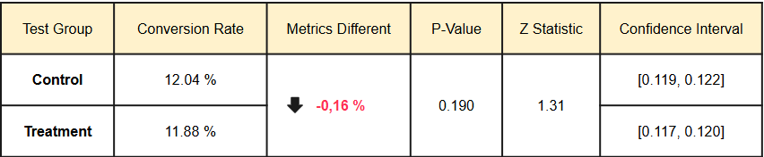
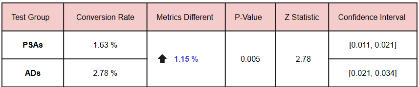

# **Evaluate the Effectiveness of the New Campaign With A/B Testing** 🆎

---

## **Project Description:**

This project aims to determine if a new ad campaign significantly increases revenue compared to PSAs and if a new web page design significantly improves conversion rates compared to the existing design. This will be achieved through A/B testing and statistical analysis.

## **New Web Page Result:**

The A/B test results show **`no statistically significant difference in conversion rates between the old and new page designs`**. The p-value of 0.190 is greater than the significance level of 0.05, indicating that the observed difference is likely due to random chance. 

Therefore, it is **`recommended to retain the existing design page or explore alternative design modifications for further testing`**. The current new design page does not demonstrate a statistically significant improvement in conversion rates, and therefore, implementing it might not yield the desired positive impact on business outcomes.

## **New Ads Campaign Result:**

The A/B test shows that **`the new ad campaign significantly improves conversion rates compared to PSAs`**. With a p-value of 0.005, we can conclude that the 1.15% increase in conversion rate is not due to chance. This suggests a potential revenue gain of $1.445.55. 

It is **`recommended to implement the new ad campaign to potentially improve overall conversion rates and drive positive business outcomes`**. The statistical evidence strongly supports its effectiveness in driving conversions compared to the previous approach using public service announcements.
